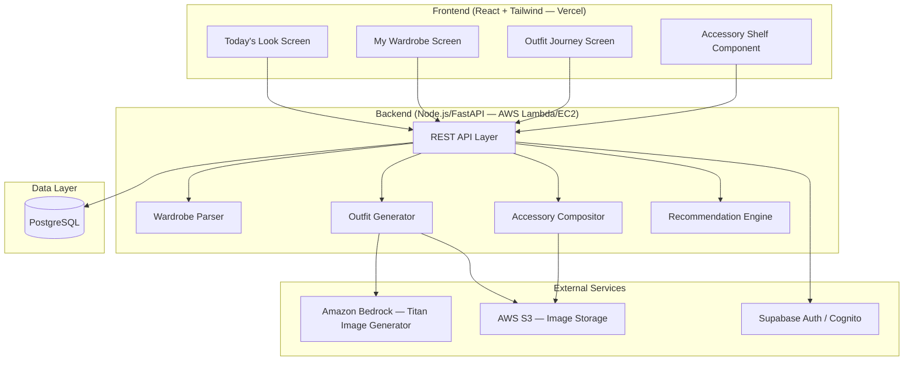
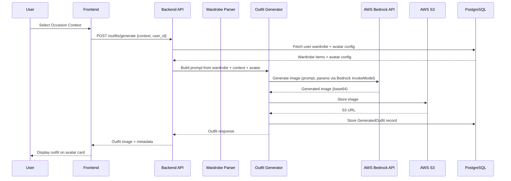
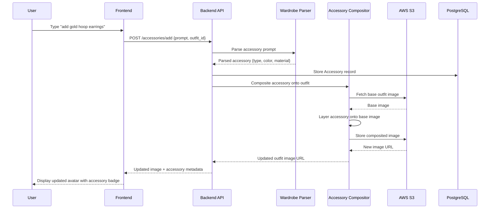
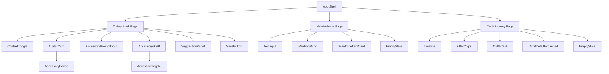
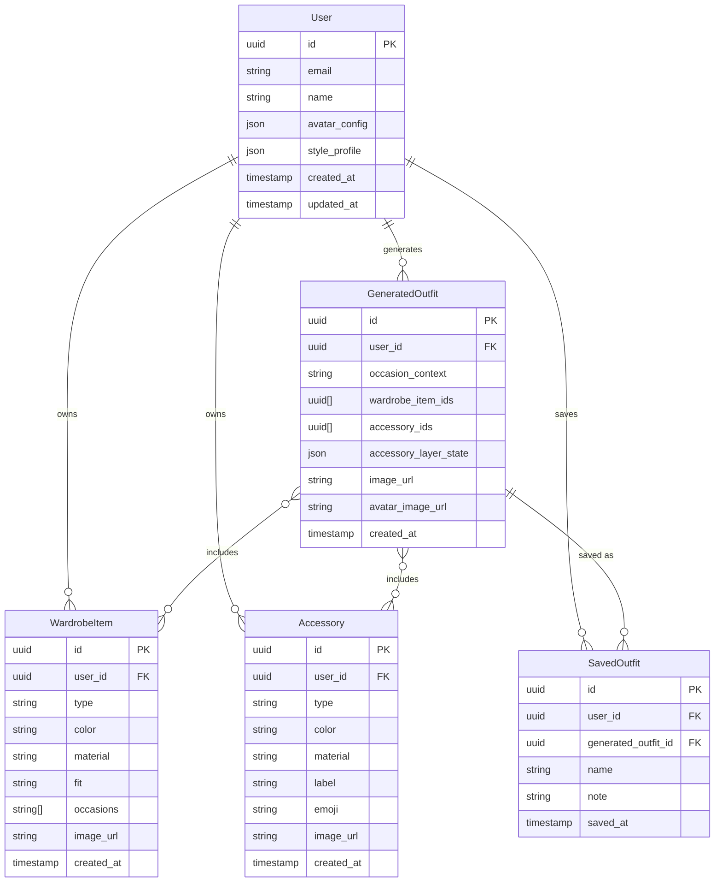

# Design Document — Drape Style Discovery

## Overview

Drape is a style discovery web application that helps users in their 20s–30s discover and evolve a personal aesthetic through AI-powered outfit generation, targeted accessory compositing, and longitudinal outfit tracking. The MVP delivers six core capabilities: plain-text wardrobe entry, occasion-based outfit generation, targeted accessory editing via compositing, accessory shelf management, outfit saving with personal notes, and an Outfit Journey timeline.

The system follows a client-server architecture with a React + Tailwind CSS frontend hosted on Vercel, a Node.js/FastAPI backend on AWS Lambda/EC2, PostgreSQL for persistent data, S3 for image storage, and Amazon Titan Image Generator (via AWS Bedrock) for outfit image generation. Authentication is handled by Supabase Auth or AWS Cognito.

### Key Design Decisions

1. **Compositing over inpainting for accessories (MVP):** Accessory editing uses image compositing (layering accessory images on top of the base outfit) rather than AI inpainting. This is faster to ship, cheaper per operation, and gives deterministic results. The architecture is designed so inpainting can replace compositing in v2 without changing the API contract.

2. **Text-first wardrobe input:** Users describe clothing in natural language. An NLP parsing layer extracts structured fields (type, color, material, fit, occasions). This lowers the onboarding barrier compared to photo upload (deferred to v2).

3. **Prompt engineering layer for outfit generation:** Rather than training a custom model, the system constructs image generation prompts from structured wardrobe data + occasion context + avatar config, sent to Amazon Titan Image Generator via AWS Bedrock. This keeps the ML surface area small and iteration fast.

4. **Accessory layer separation:** The outfit image is conceptually split into a base layer (avatar + clothing) and an accessory layer. Accessory edits only touch the accessory layer, avoiding expensive full-image regeneration.

5. **PostgreSQL for all structured data:** A single relational database handles users, wardrobe items, accessories, outfits, and saved outfits. JSON columns store flexible config objects (avatar_config, style_profile).

## Architecture



### Request Flow — Outfit Generation



### Request Flow — Accessory Compositing



## Components and Interfaces

### 1. Wardrobe Parser

Responsible for converting natural language descriptions into structured wardrobe and accessory data.

**Interface:**
```typescript
interface WardrobeParser {
  // Parse a plain text description into one or more wardrobe items
  parseWardrobe(text: string): ParseResult<WardrobeItem[]>;

  // Parse an accessory prompt into a single accessory definition
  parseAccessoryPrompt(prompt: string): ParseResult<Accessory>;

  // Format a wardrobe item back to a canonical text representation
  formatWardrobeItem(item: WardrobeItem): string;

  // Format an accessory back to a canonical text representation
  formatAccessory(accessory: Accessory): string;
}

interface ParseResult<T> {
  success: boolean;
  data?: T;
  errors?: ParseError[];
}

interface ParseError {
  segment: string;       // The portion of text that failed
  message: string;       // Human-readable error description
  position: { start: number; end: number };
}
```

**Design rationale:** The parser exposes both `parse` and `format` functions to support round-trip testing (Requirements 1.5, 6.7). Parse results use a discriminated union pattern so callers can handle errors without exceptions.

### 2. Outfit Generator

Constructs prompts from structured data and orchestrates image generation.

**Interface:**
```typescript
interface OutfitGenerator {
  // Generate an outfit image for a given context
  generateOutfit(params: OutfitGenerationParams): Promise<GeneratedOutfit>;
}

interface OutfitGenerationParams {
  userId: string;
  occasionContext: OccasionContext;
  wardrobeItems: WardrobeItem[];
  avatarConfig: AvatarConfig;
  styleProfile?: StyleProfile;
}

type OccasionContext = 'work' | 'casual' | 'night_out';

interface AvatarConfig {
  bodyType: string;
  skinTone: string;
}
```

**Design rationale:** The generator takes fully resolved data (wardrobe items, avatar config) rather than user IDs, keeping it decoupled from the data layer. The prompt engineering logic lives inside this component.

### 3. Accessory Compositor

Handles layering accessories onto existing outfit images without regenerating the base.

**Interface:**
```typescript
interface AccessoryCompositor {
  // Add an accessory to the outfit's accessory layer
  addAccessory(params: CompositeParams): Promise<CompositeResult>;

  // Remove an accessory from the outfit's accessory layer
  removeAccessory(params: RemoveParams): Promise<CompositeResult>;

  // Toggle an accessory on/off
  toggleAccessory(params: ToggleParams): Promise<CompositeResult>;
}

interface CompositeParams {
  baseImageUrl: string;
  currentAccessoryLayer: AccessoryLayerState;
  accessoryToAdd: Accessory;
}

interface RemoveParams {
  baseImageUrl: string;
  currentAccessoryLayer: AccessoryLayerState;
  accessoryToRemove: string; // accessory ID
}

interface CompositeResult {
  imageUrl: string;                    // URL of the composited image
  accessoryLayer: AccessoryLayerState; // Updated layer state
}

interface AccessoryLayerState {
  activeAccessories: AccessoryPlacement[];
}

interface AccessoryPlacement {
  accessoryId: string;
  position: { x: number; y: number };
  scale: number;
  rotation: number;
}
```

**Design rationale:** The compositor operates on image URLs and layer state, making it stateless per request. The `AccessoryLayerState` is stored alongside the outfit so any combination of add/remove operations can be replayed. This design allows a future swap to inpainting by replacing the compositor implementation without changing the interface.

### 4. Recommendation Engine

Suggests accessories based on outfit context, color palette, and usage history.

**Interface:**
```typescript
interface RecommendationEngine {
  // Suggest accessories for the current outfit
  suggestAccessories(params: SuggestionParams): Promise<AccessorySuggestion[]>;
}

interface SuggestionParams {
  currentOutfit: GeneratedOutfit;
  occasionContext: OccasionContext;
  wardrobeColorPalette: string[];
  userAccessories: Accessory[];
  accessoryHistory: AccessoryUsageRecord[];
  styleProfile?: StyleProfile;
}

interface AccessorySuggestion {
  accessory: Accessory;
  explanation: string;       // Why this accessory complements the outfit
  confidence: number;        // 0–1 score
  owned: boolean;            // Whether user already owns this
  purchaseUrl?: string;      // External link if not owned (v2)
}
```

### 5. REST API Layer

The backend exposes a RESTful API consumed by the React frontend.

**Key Endpoints:**

| Method | Path | Description |
|--------|------|-------------|
| POST | `/api/wardrobe/parse` | Parse plain text into wardrobe items |
| GET | `/api/wardrobe` | List user's wardrobe items |
| POST | `/api/wardrobe/items` | Store parsed wardrobe items |
| DELETE | `/api/wardrobe/items/:id` | Remove a wardrobe item |
| POST | `/api/outfits/generate` | Generate outfit for occasion context |
| POST | `/api/accessories/parse` | Parse accessory prompt |
| POST | `/api/accessories/composite` | Add/remove accessory on outfit |
| GET | `/api/accessories` | List user's saved accessories |
| POST | `/api/outfits/save` | Save outfit with optional note |
| GET | `/api/outfits/saved` | List saved outfits (supports filtering) |
| GET | `/api/outfits/saved/:id` | Get saved outfit detail |
| GET | `/api/recommendations/accessories` | Get accessory suggestions |
| PUT | `/api/users/avatar` | Update avatar configuration |
| POST | `/api/users/style-profile` | Submit style questionnaire |

### 6. Frontend Components



## Data Models

### Entity Relationship Diagram



### Schema Details

**User**
- `id` (UUID, PK) — unique identifier
- `email` (VARCHAR, UNIQUE, NOT NULL) — login email
- `name` (VARCHAR, NOT NULL) — display name
- `avatar_config` (JSONB) — `{ bodyType: string, skinTone: string }`
- `style_profile` (JSONB) — questionnaire responses and derived preferences
- `created_at` (TIMESTAMP) — account creation time
- `updated_at` (TIMESTAMP) — last profile update

**WardrobeItem**
- `id` (UUID, PK)
- `user_id` (UUID, FK → User.id, NOT NULL)
- `type` (VARCHAR, NOT NULL) — e.g., "shirt", "pants", "dress"
- `color` (VARCHAR, NOT NULL) — e.g., "navy", "cream"
- `material` (VARCHAR) — e.g., "cotton", "silk"
- `fit` (VARCHAR) — e.g., "slim", "relaxed", "oversized"
- `occasions` (TEXT[]) — e.g., `{"work", "casual"}`
- `image_url` (VARCHAR) — optional generated thumbnail
- `created_at` (TIMESTAMP)

**Accessory**
- `id` (UUID, PK)
- `user_id` (UUID, FK → User.id, NOT NULL)
- `type` (VARCHAR, NOT NULL) — e.g., "earrings", "necklace", "watch"
- `color` (VARCHAR, NOT NULL)
- `material` (VARCHAR) — e.g., "gold", "silver", "leather"
- `label` (VARCHAR, NOT NULL) — human-readable name, e.g., "gold hoop earrings"
- `emoji` (VARCHAR) — visual shorthand, e.g., "💍"
- `image_url` (VARCHAR) — compositing asset URL
- `created_at` (TIMESTAMP)

**GeneratedOutfit**
- `id` (UUID, PK)
- `user_id` (UUID, FK → User.id, NOT NULL)
- `occasion_context` (VARCHAR, NOT NULL) — one of `work`, `casual`, `night_out`
- `wardrobe_item_ids` (UUID[]) — references to included wardrobe items
- `accessory_ids` (UUID[]) — references to active accessories
- `accessory_layer_state` (JSONB) — positions, scales, rotations of composited accessories
- `image_url` (VARCHAR, NOT NULL) — S3 URL of the generated outfit image
- `avatar_image_url` (VARCHAR) — S3 URL of the avatar-only base image
- `created_at` (TIMESTAMP)

**SavedOutfit**
- `id` (UUID, PK)
- `user_id` (UUID, FK → User.id, NOT NULL)
- `generated_outfit_id` (UUID, FK → GeneratedOutfit.id, NOT NULL)
- `name` (VARCHAR) — optional outfit name
- `note` (VARCHAR(280)) — personal note, max 280 chars
- `saved_at` (TIMESTAMP, NOT NULL)

### Indexes

- `wardrobe_items(user_id)` — fast wardrobe lookup per user
- `accessories(user_id)` — fast accessory lookup per user
- `generated_outfits(user_id, created_at)` — chronological outfit listing
- `saved_outfits(user_id, saved_at)` — timeline queries
- `saved_outfits(user_id, occasion_context)` — filtered timeline queries

## Correctness Properties

*A property is a characteristic or behavior that should hold true across all valid executions of a system — essentially, a formal statement about what the system should do. Properties serve as the bridge between human-readable specifications and machine-verifiable correctness guarantees.*

### Property 1: Wardrobe parse round-trip

*For any* valid set of WardrobeItems, formatting each item to its canonical text representation and then parsing that text back should produce WardrobeItems equivalent to the originals.

**Validates: Requirements 1.5**

### Property 2: Accessory parse round-trip

*For any* valid Accessory definition, formatting the accessory to its canonical text representation and then parsing that text back should produce an Accessory equivalent to the original.

**Validates: Requirements 6.7**

### Property 3: Wardrobe parser produces structured items

*For any* valid plain text wardrobe description containing N distinct clothing items, the Wardrobe_Parser should produce exactly N WardrobeItems, each with non-empty type, color, material, fit, and occasions fields.

**Validates: Requirements 1.1, 1.2**

### Property 4: Parser error reporting for invalid inputs

*For any* text string that does not contain a valid clothing item or accessory description, the parser should return a ParseError that includes the unparseable segment text and its position within the input.

**Validates: Requirements 1.3, 6.6**

### Property 5: Outfit prompt selects occasion-appropriate wardrobe items

*For any* set of WardrobeItems with tagged occasions and any selected OccasionContext, the generated prompt should only reference WardrobeItems whose occasions list includes the selected context.

**Validates: Requirements 4.1**

### Property 6: Avatar configuration is always included in generation prompts

*For any* AvatarConfig (body type and skin tone) and any OccasionContext, the generated image prompt should contain the avatar's body type and skin tone parameters.

**Validates: Requirements 4.2, 5.3**

### Property 7: Base image invariant across accessory operations

*For any* base outfit image and any sequence of accessory add and remove operations via the Accessory_Compositor, the base outfit image URL should remain unchanged throughout all operations.

**Validates: Requirements 6.2, 6.3, 6.5**

### Property 8: Accessory toggle is a round-trip

*For any* accessory and any outfit accessory layer state, toggling the accessory on and then toggling it off should return the accessory layer to its original state.

**Validates: Requirements 7.2**

### Property 9: Accessory display state consistency

*For any* set of user accessories and any set of currently active accessory IDs, the rendered AccessoryShelf and AvatarCard should display exactly the active accessories with active visual indicators, and all accessories should appear on the shelf.

**Validates: Requirements 6.4, 7.1, 7.3**

### Property 10: Accessory suggestions are contextual and explained

*For any* generated outfit, OccasionContext, and wardrobe color palette, every AccessorySuggestion returned by the Recommendation_Engine should include a non-empty explanation string and should be contextually appropriate for the given OccasionContext.

**Validates: Requirements 8.1, 8.4**

### Property 11: Saved outfit data round-trip

*For any* valid outfit state (with wardrobe item IDs, accessory IDs, occasion context, and a personal note of ≤280 characters), saving the outfit and then retrieving it should produce a SavedOutfit with all fields matching the original state.

**Validates: Requirements 9.3**

### Property 12: Personal note length validation

*For any* string of length greater than 280 characters, the save operation should reject the note. *For any* string of length ≤280 characters (including empty string), the save operation should accept the note.

**Validates: Requirements 9.7**

### Property 13: Timeline grouping and chronological ordering

*For any* set of SavedOutfits with varying saved_at timestamps, the Outfit Journey timeline should group outfits by month/year, display a header for each distinct month, and order outfits within each month with the most recent first.

**Validates: Requirements 10.1, 11.2, 11.3**

### Property 14: Outfit card renders required fields

*For any* SavedOutfit, the rendered outfit card should contain: a mini avatar thumbnail, the OccasionContext badge, accessory emojis for each active accessory, the saved date, and a Personal_Note excerpt.

**Validates: Requirements 10.2**

### Property 15: Occasion context filter correctness

*For any* set of SavedOutfits with mixed OccasionContexts and any selected filter (Work, Casual, Night Out), the filtered result should contain only outfits matching the selected context. When the "All" filter is selected, all outfits should be returned.

**Validates: Requirements 10.4, 10.5**

### Property 16: Purchase recommendations exclude owned accessories

*For any* user with a set of owned accessories, every accessory in the purchase recommendation list should have an ID not present in the user's owned accessory set.

**Validates: Requirements 12.1**

### Property 17: Wardrobe item card renders required fields

*For any* WardrobeItem, the rendered WardrobeItemCard should contain the item's type, color, and material as visible text.

**Validates: Requirements 2.2**

## Error Handling

### Parser Errors

| Error Scenario | Handling Strategy |
|---|---|
| Unrecognizable wardrobe text | Return `ParseResult` with `success: false` and `ParseError[]` identifying the unparseable segments with position offsets. Display inline error highlighting in the text input. |
| Unrecognizable accessory prompt | Return `ParseResult` with `success: false` and a `ParseError` describing why the prompt couldn't be interpreted as an accessory. Display error message below the prompt input. |
| Ambiguous item description | Parser attempts best-effort extraction. If confidence is low, return the parsed item with a warning flag so the UI can prompt the user to confirm or correct. |

### Image Generation Errors

| Error Scenario | Handling Strategy |
|---|---|
| Bedrock API timeout | Retry with exponential backoff (max 3 attempts). If all retries fail, display a friendly error with a "Try Again" button. Cache the prompt so retry doesn't require re-computation. |
| Bedrock API throttling | Queue the request and display a "Generating..." state with estimated wait time. Process queued requests as capacity becomes available. |
| Invalid prompt (rejected by API) | Log the prompt for debugging. Display a generic "We couldn't generate that outfit" message with a suggestion to modify wardrobe items or context. |
| S3 upload failure | Retry upload (max 2 attempts). If failed, store the generated image in memory temporarily and schedule a background retry for S3 persistence. |

### Accessory Compositor Errors

| Error Scenario | Handling Strategy |
|---|---|
| Base image not found in S3 | Return error to frontend. Display message asking user to regenerate the outfit. |
| Compositing failure (invalid placement) | Fall back to default placement coordinates for the accessory type. Log the failure for debugging. |
| Accessory asset not found | Use a placeholder emoji badge instead of the composited image. Queue asset generation in the background. |

### Data Validation Errors

| Error Scenario | Handling Strategy |
|---|---|
| Personal note exceeds 280 characters | Client-side: prevent submission, show character count and warning. Server-side: reject with 400 status and validation message. |
| Missing required fields on save | Server-side validation returns 400 with field-level error messages. Frontend displays inline validation errors. |
| Duplicate wardrobe item | Allow duplicates (users may own multiple similar items). No deduplication enforced. |

### Authentication & Authorization Errors

| Error Scenario | Handling Strategy |
|---|---|
| Expired session token | Redirect to login. Preserve the user's current state (unsaved outfit, text input) in session storage so it can be restored after re-authentication. |
| Unauthorized access to another user's data | Return 403. Log the attempt. Never expose another user's data in error messages. |

### Network & Infrastructure Errors

| Error Scenario | Handling Strategy |
|---|---|
| Database connection failure | Return 503 with retry-after header. Frontend displays "Service temporarily unavailable" with auto-retry. |
| Frontend API call failure | Display contextual error toast. Provide retry action. Do not lose user input on error. |

## Testing Strategy

### Unit Tests

Unit tests cover specific examples, edge cases, and component behavior:

- **Wardrobe Parser**: Test specific text inputs → expected WardrobeItem outputs. Edge cases: empty string, single item, items with missing fields, unusual materials/colors.
- **Accessory Parser**: Test specific prompts → expected Accessory outputs. Edge cases: prompts with only color, only type, ambiguous descriptions.
- **Prompt Builder**: Test that specific wardrobe + context + avatar combinations produce expected prompt strings.
- **Accessory Compositor**: Test specific add/remove sequences produce expected layer states.
- **Timeline Grouping**: Test specific date sets produce expected month groupings.
- **Filter Logic**: Test each filter value against known outfit sets.
- **Note Validation**: Test boundary values (0, 1, 279, 280, 281 characters).
- **React Components**: Snapshot tests for WardrobeItemCard, AvatarCard, OutfitCard, AccessoryShelf, FilterChips. Interaction tests for toggle, save, expand behaviors.

### Property-Based Tests

Property-based tests verify universal properties across randomly generated inputs. Each property test maps to a Correctness Property defined above.

**Library:** [fast-check](https://github.com/dubzzz/fast-check) (TypeScript/JavaScript PBT library)

**Configuration:** Minimum 100 iterations per property test.

**Tag format:** Each test is tagged with a comment: `Feature: drape-style-discovery, Property {number}: {property_text}`

| Property # | Test Description | Key Generators |
|---|---|---|
| 1 | Wardrobe parse round-trip | Random WardrobeItem objects (type from enum, random color/material/fit strings, random occasion subsets) |
| 2 | Accessory parse round-trip | Random Accessory objects (type from enum, random color/material strings) |
| 3 | Parser produces structured items | Random multi-item text descriptions with known item count |
| 4 | Parser error reporting | Random non-clothing strings, gibberish, numbers, special characters |
| 5 | Occasion-appropriate item selection | Random WardrobeItem sets with tagged occasions, random OccasionContext |
| 6 | Avatar config in prompts | Random AvatarConfig (body type, skin tone), random OccasionContext |
| 7 | Base image invariant | Random base image URLs, random sequences of add/remove operations |
| 8 | Accessory toggle round-trip | Random AccessoryLayerState, random accessory to toggle |
| 9 | Accessory display state consistency | Random accessory sets, random active ID subsets |
| 10 | Suggestions contextual and explained | Random outfits, contexts, color palettes |
| 11 | Saved outfit data round-trip | Random outfit states with IDs, contexts, notes |
| 12 | Note length validation | Random strings of varying lengths (0–500 chars) |
| 13 | Timeline grouping and ordering | Random SavedOutfit sets with random timestamps spanning multiple months |
| 14 | Outfit card renders required fields | Random SavedOutfit objects |
| 15 | Occasion context filter correctness | Random SavedOutfit sets with mixed contexts, random filter selection |
| 16 | Purchase recommendations exclude owned | Random owned accessory sets, random recommendation lists |
| 17 | Wardrobe item card renders required fields | Random WardrobeItem objects |

### Integration Tests

Integration tests verify end-to-end flows with real (or mocked) external services:

- **Wardrobe entry flow**: Submit text → parse → store → retrieve → verify grid display
- **Outfit generation flow**: Select context → generate → store → display (mock Bedrock API)
- **Accessory compositing flow**: Submit prompt → parse → composite → display (mock S3)
- **Save outfit flow**: Generate outfit → add accessories → save with note → verify in timeline
- **Filter flow**: Save multiple outfits with different contexts → filter → verify results
- **Avatar config flow**: Update avatar → generate outfit → verify config propagated
- **Recommendation flow**: Generate outfit → get suggestions → verify suggestions are relevant

### End-to-End Tests

E2E tests verify critical user journeys in a browser environment (Playwright or Cypress):

1. New user: onboard → add wardrobe items → generate first outfit → save
2. Returning user: switch context → add accessory via prompt → toggle from shelf → save
3. Outfit Journey: save multiple outfits → browse timeline → filter by context → expand detail
