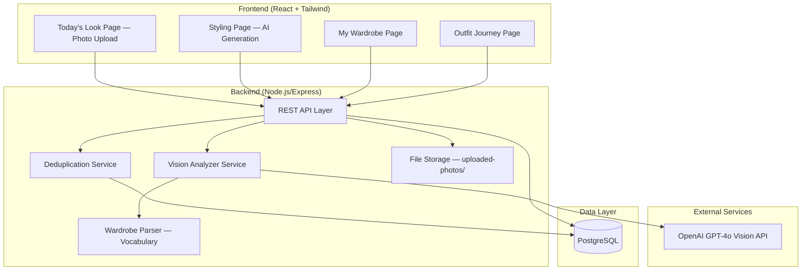
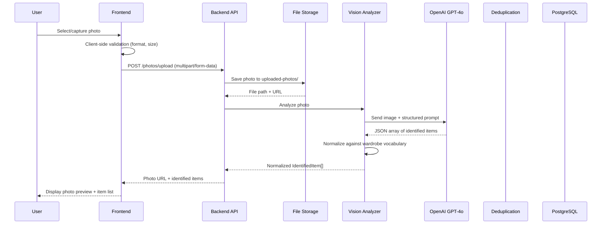
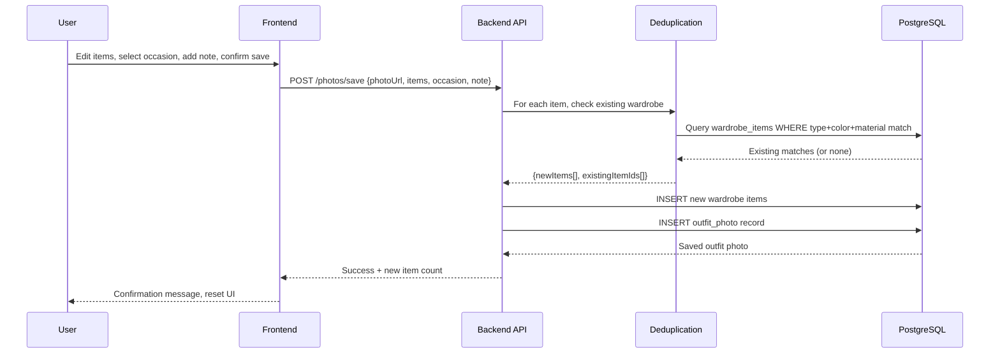
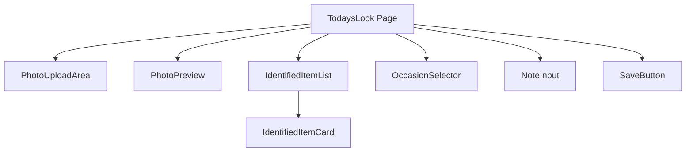
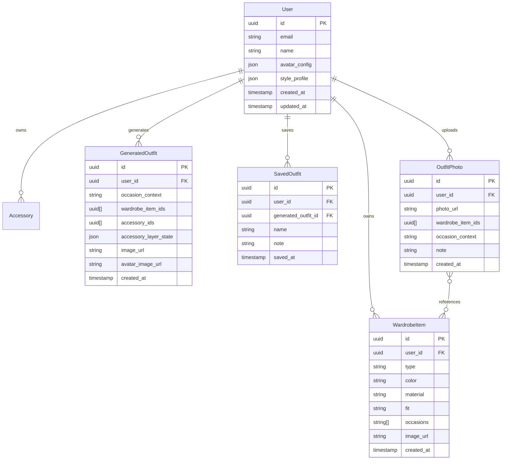

# Design Document — Today's Look Photo Upload

## Overview

This feature transforms the "Today's Look" page from an AI outfit generation tool into a photo-upload-based outfit documentation feature. Users upload a photo of themselves wearing today's outfit, and the app uses OpenAI GPT-4o vision to identify clothing items in the photo. Identified items are automatically added to the wardrobe (with deduplication), and the photo is saved as a dated entry in the Outfit Journey timeline. The existing AI outfit generation features relocate to a new "Styling" page at `/styling`.

### Key Design Decisions

1. **GPT-4o vision for clothing recognition**: Rather than training a custom model or using a dedicated fashion API, we send the uploaded photo to OpenAI GPT-4o with a structured prompt requesting clothing identification in JSON format. This leverages the existing OpenAI integration and provides high-quality results with minimal infrastructure.

2. **Reuse wardrobe parser vocabulary for normalization**: The Vision Analyzer normalizes GPT-4o output against the existing `KNOWN_TYPES`, `KNOWN_COLORS`, and `KNOWN_MATERIALS` arrays from `wardrobeParser.ts`. This ensures consistency between text-parsed wardrobe items and vision-detected items.

3. **Local file storage for photos**: Uploaded photos are stored in an `uploaded-photos/` directory on the backend, served via Express static middleware — the same pattern used for `generated-images/`. This avoids S3 complexity for the MVP.

4. **Deduplication by type + color + material**: An identified item is considered a duplicate if an existing wardrobe item matches on all three fields (case-insensitive). This is simple, deterministic, and avoids false positives from fuzzy matching.

5. **Navigation restructure with minimal disruption**: The existing TodaysLook page component is relocated to a new Styling page. The new Today's Look page is a fresh component focused on photo upload. This avoids complex refactoring of the existing page.

6. **Outfit photos as a separate table**: Rather than overloading the `saved_outfits` table, a new `outfit_photos` table stores photo entries with their own schema. The Outfit Journey timeline queries both tables and merges results chronologically.

## Architecture



### Request Flow — Photo Upload & Analysis



### Request Flow — Save Outfit Photo



## Components and Interfaces

### 1. Vision Analyzer Service

Sends uploaded photos to OpenAI GPT-4o and normalizes the response against the wardrobe vocabulary.

**Interface:**
```typescript
interface VisionAnalyzer {
  analyzePhoto(imagePath: string): Promise<VisionAnalysisResult>;
}

interface VisionAnalysisResult {
  success: boolean;
  items: IdentifiedItem[];
  error?: string;
}

interface IdentifiedItem {
  type: string;       // Normalized against KNOWN_TYPES
  color: string;      // Normalized against KNOWN_COLORS
  material: string;   // Normalized against KNOWN_MATERIALS
}
```

**GPT-4o Prompt Strategy:**
The prompt instructs GPT-4o to identify all visible clothing items and return a JSON array. Each item must include type, color, and material. The prompt includes the known vocabulary lists so GPT-4o maps its observations to recognized values. If a value doesn't match the vocabulary, GPT-4o returns its best guess and the normalizer maps it to the closest match or "unknown".

### 2. Deduplication Service

Compares identified items against the user's existing wardrobe to determine which are new.

**Interface:**
```typescript
interface DeduplicationService {
  checkItems(
    userId: string,
    items: IdentifiedItem[]
  ): Promise<DeduplicationResult>;
}

interface DeduplicationResult {
  newItems: IdentifiedItem[];           // Items not in wardrobe
  existingItems: ExistingItemMatch[];   // Items already in wardrobe
}

interface ExistingItemMatch {
  identifiedItem: IdentifiedItem;
  wardrobeItemId: string;              // ID of the matching wardrobe item
}
```

**Matching Logic:** Two items match if `type`, `color`, and `material` are all equal after lowercasing. This is a strict equality check — no fuzzy matching.

### 3. Photo Upload Endpoint

Handles multipart file upload, validates the image, stores it, and triggers vision analysis.

**Interface:**
```typescript
// POST /api/photos/upload
// Content-Type: multipart/form-data
// Body: { photo: File }
// Response: { photoUrl: string, items: IdentifiedItem[] }

// POST /api/photos/save
// Body: {
//   photoUrl: string,
//   items: IdentifiedItem[],
//   occasionContext: OccasionContext,
//   note?: string
// }
// Response: { outfitPhoto: OutfitPhoto, newItemCount: number }
```

### 4. Frontend — TodaysLook Page (New)

The new Today's Look page is a single-page flow:
1. **Upload area** — drag-and-drop or file picker + camera capture
2. **Photo preview** — displays the uploaded image
3. **Loading state** — spinner while GPT-4o analyzes
4. **Item list** — editable list of identified items with new/existing badges
5. **Occasion selector** — Work / Casual / Night Out chips
6. **Note input** — optional text field with character counter
7. **Save button** — confirms and saves the entry

**Component Tree:**


### 5. Frontend — Styling Page

The Styling page is the existing TodaysLook component relocated to `/styling`. It retains all current functionality: context toggle, avatar card, accessory prompt, accessory shelf, suggestion panel, and save button.

### 6. Updated Navbar

The Navbar adds a "Styling" link between "Today's Look" and "My Wardrobe":

```typescript
const navItems = [
  { to: '/', label: "Today's Look" },
  { to: '/styling', label: 'Styling' },
  { to: '/wardrobe', label: 'My Wardrobe' },
  { to: '/journey', label: 'Outfit Journey' },
];
```

### 7. Updated Outfit Journey

The Outfit Journey timeline now queries both `saved_outfits` and `outfit_photos`, merging them chronologically. Outfit photo cards display the uploaded photo thumbnail instead of an avatar image.

**API Changes:**
```typescript
// GET /api/outfits/saved now returns both types:
interface JourneyEntry {
  id: string;
  type: 'generated' | 'photo';  // Discriminator
  occasionContext: OccasionContext;
  note?: string;
  date: string;                  // ISO timestamp
  // For generated outfits:
  imageUrl?: string;
  avatarImageUrl?: string;
  accessories?: { id: string; label: string; emoji: string }[];
  // For photo entries:
  photoUrl?: string;
  wardrobeItems?: { id: string; type: string; color: string; material: string }[];
}
```

### 8. REST API — New Endpoints

| Method | Path | Description |
|--------|------|-------------|
| POST | `/api/photos/upload` | Upload photo, run vision analysis, return items |
| POST | `/api/photos/save` | Save outfit photo with items, occasion, note |
| GET | `/api/photos/:id` | Get outfit photo detail |

### 9. REST API — Modified Endpoints

| Method | Path | Change |
|--------|------|--------|
| GET | `/api/outfits/saved` | Returns merged timeline of saved outfits + outfit photos |
| GET | `/api/outfits/saved/:id` | Handles both generated outfit and photo entry IDs |

## Data Models

### New Table: outfit_photos

```sql
CREATE TABLE outfit_photos (
    id UUID PRIMARY KEY DEFAULT uuid_generate_v4(),
    user_id UUID NOT NULL REFERENCES users(id) ON DELETE CASCADE,
    photo_url VARCHAR(2048) NOT NULL,
    wardrobe_item_ids UUID[] NOT NULL DEFAULT '{}',
    occasion_context VARCHAR(50) NOT NULL,
    note VARCHAR(280),
    created_at TIMESTAMP NOT NULL DEFAULT NOW()
);

CREATE INDEX idx_outfit_photos_user_id_created_at ON outfit_photos(user_id, created_at);
CREATE INDEX idx_outfit_photos_user_id_occasion_context ON outfit_photos(user_id, occasion_context);
```

### Entity Relationship Diagram (Extended)



### Shared Types (additions to @drape/shared)

```typescript
// New types for the photo upload feature
export interface IdentifiedItem {
  type: string;
  color: string;
  material: string;
}

export interface OutfitPhoto {
  id: string;
  userId: string;
  photoUrl: string;
  wardrobeItemIds: string[];
  occasionContext: OccasionContext;
  note?: string;
  createdAt: Date;
}

export interface VisionAnalysisResult {
  success: boolean;
  items: IdentifiedItem[];
  error?: string;
}
```


## Correctness Properties

*A property is a characteristic or behavior that should hold true across all valid executions of a system — essentially, a formal statement about what the system should do. Properties serve as the bridge between human-readable specifications and machine-verifiable correctness guarantees.*

### Property 1: File upload validation

*For any* file with a MIME type and size, the upload validator SHALL accept the file if and only if the MIME type is one of `image/jpeg`, `image/png`, or `image/webp` AND the file size is ≤ 10 MB. All other combinations SHALL be rejected with an appropriate error message.

**Validates: Requirements 1.3, 1.4, 1.5**

### Property 2: Vision normalizer produces valid vocabulary values

*For any* raw clothing item output from GPT-4o (with arbitrary type, color, and material strings), the normalizer SHALL produce an IdentifiedItem where the `type` field is either a value from `KNOWN_TYPES` or the original value, the `color` field is either a value from `KNOWN_COLORS` or "unknown", and the `material` field is either a value from `KNOWN_MATERIALS` or "unknown".

**Validates: Requirements 2.3**

### Property 3: Deduplication correctness

*For any* set of IdentifiedItems and any set of existing WardrobeItems belonging to a user, the deduplication service SHALL classify each IdentifiedItem as "existing" if and only if there exists a WardrobeItem with matching type, color, and material (case-insensitive), and as "new" otherwise. The union of new items and existing item matches SHALL equal the original IdentifiedItems set with no items lost or duplicated.

**Validates: Requirements 3.1, 3.2, 3.3**

### Property 4: Item removal exclusion

*For any* list of IdentifiedItems and any subset marked for removal, the save payload SHALL contain exactly the items NOT in the removal subset, preserving their order and field values.

**Validates: Requirements 4.3**

### Property 5: Save payload validation

*For any* save request, the system SHALL reject the request if no OccasionContext is provided. *For any* Personal_Note string with length > 280 characters, the system SHALL reject the request. *For any* save request with a valid OccasionContext and a note of ≤ 280 characters (or no note), the system SHALL accept the request.

**Validates: Requirements 5.2, 6.2, 6.3**

### Property 6: Outfit photo data round-trip

*For any* valid OutfitPhoto record (with photo URL, wardrobe item IDs, occasion context, optional note ≤ 280 chars, and timestamp), saving the record and then retrieving it by ID SHALL produce an OutfitPhoto with all fields matching the original values.

**Validates: Requirements 6.4, 7.1, 10.1, 10.4**

### Property 7: Timeline chronological ordering

*For any* set of OutfitPhotos and SavedOutfits with varying timestamps, the merged Outfit Journey timeline SHALL order all entries by date descending (most recent first) within each month group, and month groups SHALL be ordered most recent first.

**Validates: Requirements 7.2**

### Property 8: Occasion context filter correctness

*For any* set of OutfitPhotos and SavedOutfits with mixed OccasionContexts and any selected filter value (work, casual, night_out), the filtered result SHALL contain only entries whose OccasionContext matches the selected filter. When no filter is applied ("all"), all entries SHALL be returned.

**Validates: Requirements 7.5**

### Property 9: Outfit photo card renders required fields

*For any* OutfitPhoto with a photo URL, occasion context, creation date, and optional note, the rendered journey card SHALL contain: the photo as a thumbnail image, the occasion context as a badge, the formatted date, and a note excerpt (if note is present).

**Validates: Requirements 7.3**

### Property 10: Retrieved outfit photo includes resolved wardrobe items

*For any* OutfitPhoto with N wardrobe item IDs that all reference existing WardrobeItems, retrieving the outfit photo detail SHALL return exactly N wardrobe item objects, each containing id, type, color, and material fields matching the referenced WardrobeItem.

**Validates: Requirements 10.3**

## Error Handling

### Photo Upload Errors

| Error Scenario | Handling Strategy |
|---|---|
| Invalid file format | Client-side: check MIME type before upload, display inline error listing accepted formats (JPEG, PNG, WebP). Server-side: reject with 400 and format error message. |
| File too large (> 10 MB) | Client-side: check `file.size` before upload, display error with max size. Server-side: reject with 413 (Payload Too Large). |
| Upload network failure | Display error toast with retry button. Preserve the selected file reference so the user doesn't need to re-select. |
| File system write failure | Return 500 to client. Log error. Display "Upload failed, please try again" message. |

### Vision Analysis Errors

| Error Scenario | Handling Strategy |
|---|---|
| OpenAI API timeout | Retry once with 10s timeout. If retry fails, return error to frontend with "Try again" option. |
| OpenAI API rate limit (429) | Return 503 to frontend with retry-after hint. Display "Service busy, please try again in a moment." |
| GPT-4o returns invalid JSON | Log the raw response. Return error to frontend indicating analysis failed. Provide retry option. |
| GPT-4o returns empty items array | Return success with empty items. Frontend displays "No clothing items detected" message with suggestion to try a different photo. |
| GPT-4o returns items with unrecognized vocabulary | Normalizer maps unrecognized values to closest match or "unknown". Never fails — graceful degradation. |

### Save Errors

| Error Scenario | Handling Strategy |
|---|---|
| Missing occasion context | Client-side: disable save button until occasion is selected. Server-side: reject with 400 and validation message. |
| Note exceeds 280 characters | Client-side: prevent typing beyond 280 chars, show character counter turning red. Server-side: reject with 400. |
| Database write failure | Return 500. Display "Save failed, please try again." Preserve all form state so user doesn't lose their edits. |
| Referenced wardrobe item IDs invalid | Log warning. Save the outfit photo anyway — orphaned IDs are acceptable (items may have been deleted). |

### Navigation & Routing Errors

| Error Scenario | Handling Strategy |
|---|---|
| User navigates to old Today's Look URL expecting AI generation | The `/` route now shows photo upload. The Styling page at `/styling` has the AI features. No redirect needed — the nav clearly labels both. |
| Deep link to non-existent photo ID | Return 404 from API. Frontend displays "Photo not found" message. |

## Testing Strategy

### Unit Tests

Unit tests cover specific examples, edge cases, and component behavior:

- **File Validator**: Test specific file types and sizes against acceptance criteria. Edge cases: 0-byte file, exactly 10 MB, 10 MB + 1 byte, SVG file, PDF file.
- **Vision Normalizer**: Test specific GPT-4o response shapes → expected IdentifiedItem outputs. Edge cases: empty response, items with unknown types, mixed case values, extra fields in response.
- **Deduplication Service**: Test specific item sets against known wardrobe contents. Edge cases: empty wardrobe, all items match, no items match, case differences.
- **Note Validator**: Test boundary values (0, 1, 279, 280, 281 characters).
- **Save Payload Builder**: Test that removed items are excluded and edited items use new values.
- **Timeline Merger**: Test merging outfit photos and saved outfits with known dates into expected order.
- **React Components**: Render tests for PhotoUploadArea, IdentifiedItemList, IdentifiedItemCard, OccasionSelector, NoteInput. Interaction tests for file selection, item removal, item editing, occasion selection.
- **Navbar**: Verify four items render in correct order with correct links.
- **Styling Page**: Verify all relocated components render correctly.

### Property-Based Tests

Property-based tests verify universal properties across randomly generated inputs. Each property test maps to a Correctness Property defined above.

**Library:** [fast-check](https://github.com/dubzzz/fast-check) (already in project dependencies)

**Configuration:** Minimum 100 iterations per property test.

**Tag format:** Each test is tagged with a comment: `Feature: todays-look-photo-upload, Property {number}: {property_text}`

| Property # | Test Description | Key Generators |
|---|---|---|
| 1 | File upload validation | Random MIME types (from full MIME type space), random file sizes (0 to 50 MB) |
| 2 | Vision normalizer output validity | Random strings for type/color/material fields, random array lengths 0-10 |
| 3 | Deduplication correctness | Random IdentifiedItem arrays, random existing WardrobeItem arrays with overlapping and non-overlapping values |
| 4 | Item removal exclusion | Random IdentifiedItem arrays (1-10 items), random boolean masks for removal |
| 5 | Save payload validation | Random OccasionContext (including undefined), random note strings (0-500 chars) |
| 6 | Outfit photo data round-trip | Random OutfitPhoto objects with valid fields |
| 7 | Timeline chronological ordering | Random sets of OutfitPhotos and SavedOutfits with timestamps spanning multiple months |
| 8 | Occasion context filter correctness | Random journey entries with mixed contexts, random filter selection |
| 9 | Outfit photo card renders required fields | Random OutfitPhoto objects with all field combinations |
| 10 | Retrieved photo includes resolved wardrobe items | Random OutfitPhoto with 0-5 wardrobe item IDs, corresponding WardrobeItem objects |

### Integration Tests

Integration tests verify end-to-end flows with mocked external services:

- **Photo upload flow**: Upload file → store → analyze (mock GPT-4o) → return items
- **Save flow**: Upload → analyze → edit items → select occasion → add note → save → verify in DB
- **Deduplication flow**: Add wardrobe items → upload photo with matching items → verify no duplicates created
- **Timeline merge flow**: Save generated outfits + photo outfits → fetch timeline → verify merged chronological order
- **Filter flow**: Save photos with different occasions → filter → verify correct results
- **Styling page flow**: Navigate to /styling → verify all AI generation features work as before (mock Bedrock)
- **Navigation flow**: Verify all four nav items route to correct pages

### End-to-End Tests

E2E tests verify critical user journeys:

1. **Photo upload journey**: Upload photo → review items → edit one item → remove one item → select occasion → add note → save → verify in Outfit Journey
2. **Deduplication journey**: Add items to wardrobe via text → upload photo with same items → verify no duplicates, items linked correctly
3. **Navigation journey**: Visit each of the four pages via nav, verify correct content on each
4. **Styling page journey**: Navigate to /styling → generate outfit → add accessory → save → verify in Outfit Journey
